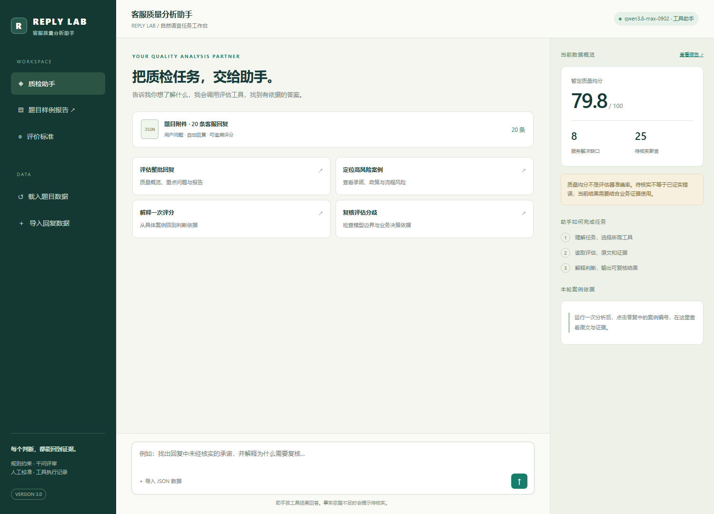
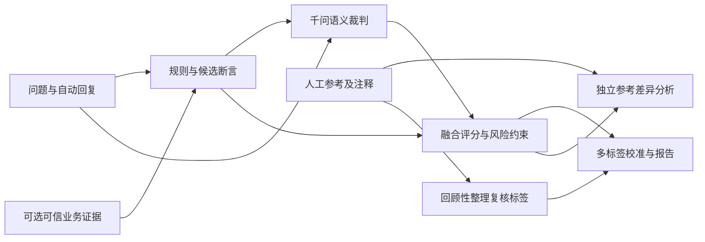

# REPLY LAB v3 · 客服回复质检 Agent

一套面向题目 **0109** 的可解释评估系统：**规则引擎 + 千问语义裁判 + 人工参考校准**，附独立的参考回复成对分析。v3 先改进评价量表，再加入能够选择工具、查看结果并继续执行的客服质检 Agent：用自然语言分析一批回复、解释评分、定位待核实承诺、检查人工分歧、补充业务证据并生成报告。

设计顺序：[v3 实施方案](docs/v3-plan.md) → [评价标准](docs/rubric-v3.md) → [Agent 架构](docs/agent-architecture.md) → [真实实验结果](docs/results-analysis.md)。[早期设计](docs/design.md)和[修订记录](docs/decisions.md)保留决策过程。核心程序只依赖 Python 标准库。

## 启动 Agent

配置下文的本地 `.env` 后运行：

```powershell
python serve.py
```

打开 **http://127.0.0.1:8765**。页面预载已完成的 20 条真实评估，可直接输入：

- “分析当前这批回复，说明主要问题并生成报告。”
- “case_16 为什么得到这个分数？结合原文说明。”
- “这次评价与人工标签有哪些分歧？能扩大覆盖吗？”
- “打开 case_08 的证据表单。”

页面展示实际工具轨迹、案例原文与分数；支持上传 1–100 条新 JSON。上传后清空旧分数和上下文，Agent 执行新评估。证据表单要求原文断言、来源、支持/矛盾结论和理由，再由程序重算；模型不能自行替你证明事实。聊天和人工证据仅保存在当前服务会话，重启服务会丢失，重要结果请先生成报告并下载 JSON。

这是本地单人原型：默认只监听本机，使用受限工具调度，没有接入真实订单操作或多人权限。Agent 调度使用真实千问；`--evaluation-mode mock` 只将新数据评分切换为 mock，仍需要模型 API 进行调度。无需 API 的演示请查看静态报告或运行下面的 mock CLI。



## v3 改进效果

在同样的 20 条样本、同样的冻结标签上，问题标签 Micro Precision 从 **59.5% → 75.0%**，Recall 从 **73.3% → 60.0%**，F1 从 **0.6567 → 0.6667**。误报减少，但漏检增加；共情识别仍弱。10 条预先固定的构造行为样例通过 34/34 项断言。这些是已见样本与开发测试，不能证明业务泛化能力。

量表更明确地区分合理澄清、轻微缺口与处理受阻；中性咨询无需强行道歉；用户已经卡在流程时不能只重复流程。原始维度始终为 **0–4 分**，总分为 0–100。没有业务证据时事实维度弃权，当前平均 **79.8** 仅为暂定回复质量分，不能解释为评估器准确率。完整结果和旧版保留在 [experiments](experiments/) 与 Git 历史。

## 快速查看

- **真实模型结果**：[交互看板](output/index.html) · [分析报告](output/report.md) · [逐条 JSON](output/results.json) · [评分 CSV](output/scores.csv)
- **人工校准**：[多标签指标及分歧](output/issue_validation.json) · [服务缺口对照](output/validation.json)
- **参考回复差异**：[成对分析报告](output/comparison.md)，也可在看板展开任意案例查看。
- **离线基线**：[mock 看板](output-mock/index.html)，用于工程复现，不能充当真实 LLM 效果。
- **实验总结**：[真实结果与基线对照](docs/results-analysis.md)
- **验证与截图**：[验证记录](docs/verification.md) · `screenshots/`

直接双击 `output/index.html`，无需启动服务器。看板支持搜索、按质量状态筛选、按分数排序、查看证据、人工校准和独立参考差异。

## 运行

环境：Python 3.10+，已在 Windows / Python 3.12 验证。核心运行无需 pip 安装包。

```powershell
# 离线演示：动态规则生成 mock 语义结果，无 API 调用
python run.py --mode mock --output output-mock

# 纯规则对照
python run.py --mode rules --output output-rules

# 真实千问评估 + 独立参考差异（首次预计 20 + 20 次模型请求）
python run.py --mode llm --pairwise --output output

# 工程测试，无网络调用
python -m unittest discover -s tests -v
```

真实模式读取 `.env` 或环境变量。复制 `.env.example` 为 `.env`，设置：

```dotenv
DASHSCOPE_API_KEY=填写你自己的密钥
LLM_BASE_URL=https://dashscope.aliyuncs.com/compatible-mode/v1
LLM_MODEL=qwen3.8-max-0902
LLM_EXTRA_BODY={"enable_thinking":false}
```

本次模型由用户指定为 `qwen3.8-max-0902`。服务地址须与账号区域一致；跨服务兼容时可设置 `LLM_EXTRA_BODY={}`。凭据不进入评分文件或报告，`.env` 与缓存已加入 `.gitignore`，提交包不含凭据。

请求使用兼容 Chat Completions 的 JSON Object 输出，程序进一步校验结构、分值、标签和原文证据。参考：[千问兼容接口](https://help.aliyun.com/zh/model-studio/qwen-api-via-openai-chat-completions)、[千问结构化输出](https://help.aliyun.com/zh/model-studio/qwen-structured-output)、[OpenAI 结构化输出说明](https://developers.openai.com/api/docs/guides/structured-outputs)。JSON 合法本身不保证字段正确，因此仍需要本地校验。

真实模式按请求内容、模型、服务地址与提示词缓存到 `.cache/llm/`；相同请求再次运行优先复用缓存。报告区分本次 API 请求数与缓存命中数。HTTP 429/部分 5xx 最多重试两次；超时、非法 JSON、字段异常或证据不在原文时显式失败，不静默降级为 mock。部分完成的已校验响应可在下次运行复用。缓存中的文本可能属于业务数据，默认不发布。

### 评估新数据

```powershell
python run.py --mode llm --input new_replies.json --output new-output
```

新输入为非空数组，每条包含唯一非空 `id`、`user_question`、`auto_reply`。输入不是默认附件时，程序不会自动套用原来的人工参考或标签。可显式传入 `--reference`、`--labels`、`--issue-labels`。`--no-reference` 可关闭默认参考与校准数据。

### 接入业务证据

```powershell
python run.py --mode llm --evidence business_evidence.json --output verified-output
```

证据数组结构如下（仅示意，不代表附件事实）：

```json
[
  {
    "quote": "与抽取出的回复断言完全一致的原文片段",
    "status": "supported",
    "source": "经过人工确认的政策版本或工具记录标识",
    "rationale": "该来源如何支持这一断言"
  }
]
```

`status` 仅支持 `supported` / `contradicted`。此原型信任证据文件的人工维护者，不自动验证来源真伪；精确匹配是保守策略，不支持复杂的语义检索或自动业务政策推理。规则与模型未抽取到的断言仍可能漏检。

## 指标定义及理由

| 指标 | 测量内容 | 权重 | 选择理由 |
|---|---|---:|---|
| 切题与一致性 | 是否理解诉求、覆盖事项、内部前后一致 | 25% | 避免答非所问与流程矛盾；仅是准确性的局部代理 |
| 问题解决有效性 | 针对性、必要追问、可执行下一步与操作负担 | 35% | 客服的核心价值是推动问题解决，不是只给通用知识 |
| 语气与情境关怀 | 尊重、安抚、回应特殊经历 | 15% | 避免只有模板礼貌而忽略情境 |
| 事实依据 | 商品/政策/功能/承诺是否有可信证据 | 25% | 识别待核实断言，防止无根据的确定性承诺 |

前三项 0–4 分锚点：4 无明显缺口；3 轻微问题；2 明显缺口、部分满足；1 严重缺口；0 完全失败。事实依据单独采用“支持=4、证据矛盾=0、未知/无断言=N/A”，不把无法核实的事实硬判为错误。更细的量表在 [主评审提示词](prompts/judge.md)。

`综合分 = 100 × Σ(可评权重 × 维度分/4) / Σ(可评权重)`。

缺少事实证据时显示**暂定质量分**及覆盖率，不将其等同于完整质量。确认事实错误或明确流程冲突时总分上限为 49，避免语气掩盖严重问题；未经核实的高风险承诺进入复核队列，不自动认定为已证实错误。

状态由高到低优先判定：高风险待复核 → 需要改进 → 可接受（可能为暂定）。分数低于 80 或有效性 ≤2 判需要改进；权重、阈值、门控均在 [config.json](config.json)，属于待业务校准的工程配置。

## 评估方法与数据隔离



规则层不按案例编号写分数，也不读取人工参考。真实 LLM 只收到问题、回复、量表和带来源状态的候选断言。LLM 四维基础分经过事实证据约束、流程冲突门控、攻击性表达约束融合；普通启发式扣分不再与 LLM 重复累加。

事实核验是有条件的：规则做显式证据匹配，LLM 补充潜在断言；两者都不具备凭空访问商家订单与政策的能力。附件无业务证据时只能给出待核实及风险。

## 人工校准与参考对比

原附件没有数值评分。为避免伪造总分金标准，本项目提供两套公开复核标签：

- [服务缺口二元标签](data/review_labels.json)：用于服务有效性不足的粗粒度一致性验证。
- [五类问题标签](data/issue_labels.json)：`passive_service`、`generic_answer`、`missing_clarification`、`insufficient_empathy`、`intent_mismatch`。逐条附归纳理由，`unknown` 的样本-标签对不进入指标分母。

多标签报告提供每标签与 micro/macro Precision、Recall、F1、分母、排除数量和分歧。没有预测正例时 Precision 为 N/A，而不是伪造为满分。标签是根据原注释**重新整理**的，不是附件原生字段；轻微问题标签不自动等于整体不可用。

开发者已经查看所有 20 条附件，因此这些结果是**回顾性校准，不是独立盲测**。程序隔离参考答案可以防止运行时泄漏，不能消除规则与提示词设计时的偏差。尚未有人工数值评分，所以不计算总分相关性。

独立成对分析同时读取自动回复、人工参考及注释，输出“已覆盖 / 参考新增 / 差距 / 改进 / 参考局限”。它**不参与主分数和标签一致性计算**，也不把与参考相似作为质量标准。不使用嵌入相似度作为主分数，因为语义相近不等于解决了问题。

## 局限性与下一步

1. 20 条非随机样本不能代表总体质量；不能用当前指标直接判断扩大上线。
2. 无商品、订单、政策与工具调用证据，事实评分大量弃权；参考中的 TPU、质保或赔付也不能自证。
3. 缺少系统能力说明，模型可能过度要求主动代办；回复中的“我帮您”也未必真的执行。
4. 共情标签主观，部分注释与原回复冲突；应补双人标注及仲裁，保留争议。
5. 同义表达、上下文省略、反讽等会影响规则和模型；事实抽取是句段级，覆盖率不能代表全部事实。
6. 温度为 0 也不保证跨时间逐字复现；缓存可复现本次输出，但不证明模型稳定性。应增加独立重复实验。
7. 后续接入有版本的业务证据，再用新采集、未参与设计的保留集比较模型与规则，测量稳定性、成本、漏检和人工复核收益。

## AI 工具使用说明

Codex 辅助完成方案设计、Python/HTML 实现、提示词、测试、参考标签归纳、结果分析和文档。运行时真实语义裁判及参考对比使用用户指定的千问模型。标签未经第二位人工标注者独立复核，不把 AI 辅助整理的标签宣传成独立专家金标准。浏览器截图为实际生成报告的截图。

## 主要目录

```text
run.py                    命令行入口、输入校验及流程编排
serve.py                  本地 Agent 启动入口
assistant_app/            工具调度、会话服务及聊天工作台
config.json               融合权重与门控阈值
evaluation/core.py        规则基线、候选事实与证据匹配
evaluation/semantic.py    真实 API、mock、输出校验与融合
evaluation/validation.py  二元及多标签校准
evaluation/comparison.py 独立参考差异分析
evaluation/reports.py     JSON / CSV / Markdown / HTML 输出
evaluation/dashboard.html 离线交互看板模板
prompts/                  可版本化的主评审与对比提示词
data/                     有理由、有未知掩码的复核标签
tests/                    工程回归测试
docs/                     设计、修订、结果分析与验证记录
output/                   真实模型结果
output-mock/              离线基线结果
screenshots/              真实运行截图
experiments/              冻结旧版、行为实验及真实 Agent 验收
```
