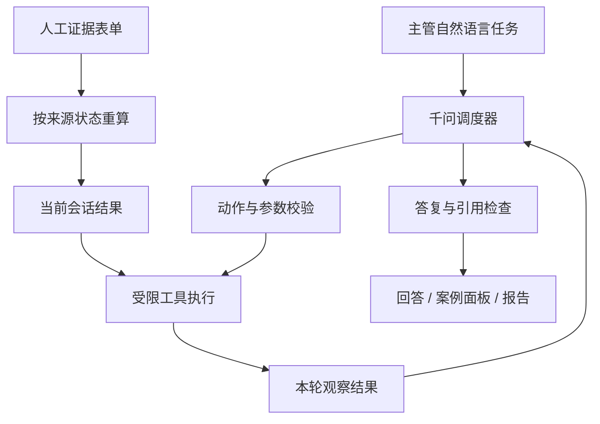

# 客服质检 Agent：架构与运行边界

## 场景与执行方式

客服主管提出“分析这批回复并生成报告”，Agent 根据当前数据是否已经评估，选择检查、评估、查询和导出工具。每次工具执行后，真实结果加入观察列表，由千问决定继续调用工具还是回答。查询单条评分时直接读取该案例，避免无意义地重跑整批。

采用兼容 Chat Completions 的结构化 JSON 调度协议，不依赖特定厂商的原生 function calling。模型选择的是已注册的 Python 工具；参数由本地校验，实际计算由评估系统完成。界面显示操作摘要和真实工具轨迹，不展示模型隐式推理。

## 工具清单

| 工具 | 输入 | 作用 |
|---|---|---|
| inspect_dataset | 无 | 查看记录数、字段及是否已评估 |
| get_rubric | 无 | 读取实际运行量表和配置 |
| evaluate_batch | 无 | 对当前数据执行评估；已有结果时复用 |
| get_overview | 无 | 查询汇总、量表分母、事实状态和校准指标 |
| find_cases | 筛选条件、数量 | 查找低分、高风险、待核实或分歧案例 |
| get_case | 案例编号 | 获取原文、评分、标签、证据与参考差异 |
| review_disagreements | 无 | 对照人工标签，列出误报/漏检；新数据无标签时明确不可比较 |
| request_evidence | 案例编号 | 打开人工证据表单，不能代填来源结论 |
| export_report | 无 | 生成当前会话的 HTML、JSON、CSV、Markdown 报告 |

一轮最多执行 7 次工具、10 次模型决策。动作结构不合法时最多两次要求重新输出；仍失败则显式报错，不执行无效动作。工具错误会返回给模型，成功的结果留在当前会话。网络失败不伪装成功，不切换为 mock。

结束动作的 `brief` 可省略，因为它没有下一步操作；执行工具时必须提供简短的 `brief`。这解决了真实模型结束输出省略展示字段而导致整轮失败的问题，不放宽工具名称、参数、回答或引用的校验。

## 评估与解释分离

语义裁判只接收问题、回复、量表及候选事实。人工参考不会进入主评分；评分后才进行校准和独立对比。Agent 解释已完成结果时可以查看参考差异，但不能因此重新给主裁判灌入答案。工具统一明确：维度最高 4 分，总分最高 100 分，N/A 不等于事实错误。

真实验收曾发现助手把 4 分制写成“3/5”。现在同时从工具返回值、提示词和最终输出校验处理：检测到这种维度分母错误，要求模型重述后再交付；引用的案例必须已经在本轮工具中出现。该检查覆盖已知错误模式，不保证所有自然语言数字、因果分析都正确；重要结论仍需对照结构化报告。

## 证据与数据生命周期

- 原始输入：1–100 条 JSON，每条包含唯一 `id`、`user_question`、`auto_reply`；导入会清空旧评估、旧聊天和旧报告入口。
- 会话结果：保存在服务进程内存，浏览器通过 sessionStorage 找回当前会话。重启服务后创建新会话，不自动恢复人工证据和聊天。
- 模型缓存：`.cache/llm/` 和 `.cache/agent/`；输入与导出文件位于 `.cache/sessions/<会话编号>/`，不进入 Git。它们可能包含业务内容。
- 人工证据：按“案例编号 + 原文断言”隔离，记录来源、结论、理由；程序信任维护者提供的判断，不自动认证来源。写入报告元数据后可下载留档。
- 证据改变后旧报告入口失效，需要重新导出，防止新分数旁边展示旧报告。原始参考差异保留为历史诊断，不会因补证据而自动重新生成。

## 服务边界

HTTP 默认只监听 `127.0.0.1:8765`，校验本机 Host、变更请求来源和令牌，下载只允许指定报告文件。模型没有任意文件、shell、退款、消息发送或生产知识库修改工具。页面转义数据及模型文字，密钥仅留在服务端环境配置。

这是单人本地原型，不提供账户权限、持久化会话数据库、队列限流、取消任务或生产审计。公开部署前应补充这些能力。当前没有定时任务；CLI 已可以交给外部调度器使用，后续应建立版本化业务知识、双人标注和未见样本保留集。

## 验收材料

真实 5 轮调用见 [agent-smoke.json](../experiments/agent-smoke.json)，包含已有结果分析、单案例解释、分歧分析、请求证据、全新数据评估导出。浏览器记录见 [agent-browser-check.json](agent-browser-check.json)，截图见 `screenshots/06` 至 `09`。完整方法与实验限制见 [结果分析](results-analysis.md)。
